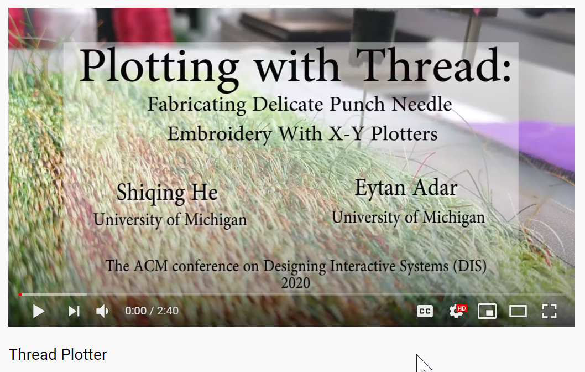

#ThreadPlotter
_A toolkit for the design and fabrication of delicate punch needle embroidery using X-Y plotters_ 
 
 ##What?
ThreadPlotter is a toolkit that supports the designing, editing, and printing of images as punch needle embroidery using a X-Y plotter. It is a supplemantary material for the paper:

["Plotting with Thread: Fabricating Delicate Punch Needle Embroidery with X-Y Plotters"
 Shiqing He, Eytan Adar, to appear, DIS'20, Honorable Mention Award](http://www.cond.org/punchneedle.html)

The following video briefly introduce the motivation for building this tool and the capability of the ThreadPlotter. 

[](http://www.youtube.com/watch?v=YOUTUBE_VIDEO_ID_HERE)

You might also be interested in this 10 minutes presentation that goes over the project in depth. 

[](http://www.youtube.com/watch?v=YOUTUBE_VIDEO_ID_HERE)

If you are interested in using this this toolkit, please consider citing our paper:[Plotting with Thread: Fabricating Delicate Punch Needle Embroidery with X-Y Plotters](http://www.cond.org/punchneedle.html)
```
#todo: add citation
```
 ##How?
 To convert your X-Y plotter into a punch needle fabricator, we will follow the following steps:
  1. Ensure that your plotter is suitable for the task. 
  2. Acquire or create several physical components such as needle, fabric, and frame.
  3. Design a punch needle pattern. 
  
 We highly recommend that you review our paper before getting started. When you are ready, click on each of the links above.   
 
 ###License
 MIT License

Copyright (c) [2020] [Shiqing He]

Permission is hereby granted, free of charge, to any person obtaining a copy
of this software and associated documentation files (the "Software"), to deal
in the Software without restriction, including without limitation the rights
to use, copy, modify, merge, publish, distribute, sublicense, and/or sell
copies of the Software, and to permit persons to whom the Software is
furnished to do so, subject to the following conditions:

The above copyright notice and this permission notice shall be included in all
copies or substantial portions of the Software.

THE SOFTWARE IS PROVIDED "AS IS", WITHOUT WARRANTY OF ANY KIND, EXPRESS OR
IMPLIED, INCLUDING BUT NOT LIMITED TO THE WARRANTIES OF MERCHANTABILITY,
FITNESS FOR A PARTICULAR PURPOSE AND NONINFRINGEMENT. IN NO EVENT SHALL THE
AUTHORS OR COPYRIGHT HOLDERS BE LIABLE FOR ANY CLAIM, DAMAGES OR OTHER
LIABILITY, WHETHER IN AN ACTION OF CONTRACT, TORT OR OTHERWISE, ARISING FROM,
OUT OF OR IN CONNECTION WITH THE SOFTWARE OR THE USE OR OTHER DEALINGS IN THE
SOFTWARE.
