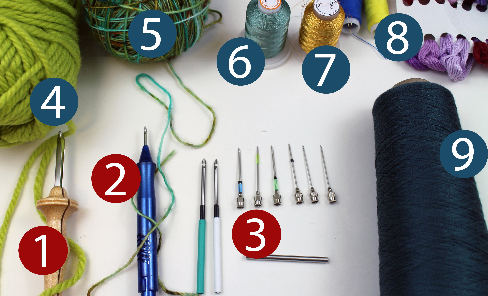

# Step 2: Physical Setup 

In this section, we will go over the materials needed for the fabrication process, including fabric, fabric stretcher, thread,  thread feeder, clamp, and punch needle.
 

## Everything you need

Here's an overview of everything you need for the project. We included purchase links for these materials for your convenience. We are not affiliated with any of the manufacture/links/platforms listed here. 
1. A plotter ([Axidraw](https://shop.evilmadscientist.com/productsmenu/890))
2. At least three spools of polyester embroidery thread ([New Brothread](https://www.amazon.com/New-brothread-Polyester-Embroidery-Husqvarna/dp/B077Z5VJHN/ref=sr_1_8?dchild=1&keywords=polyester+thread&qid=1592946623&sr=8-8))
3. Organza (fabric stores)
4. Extra fine punch needle heads ([Various manufacturers](https://www.amazon.com/BAGERLA-Embroidery-Scissors-Stitching-Beginners/dp/B07XK2X776/ref=sr_1_6?dchild=1&keywords=punch+needle&qid=1592946704&sr=8-6))
5. Gripper Frame ([Found on Etsy. We purchased a 10 x 10. The link is just an example](https://www.etsy.com/listing/701260649/punch-needle-embroidery-frame-8-x-8?ga_order=most_relevant&ga_search_type=all&ga_view_type=gallery&ga_search_query=gripper+frame&ref=sr_gallery-1-2&organic_search_click=1&cns=1))
6. Syringe, a plastic cup, and a pen cap 
7. X-acto knife 
8. clamps for stabilizing the plotter

Optional:
Plywood and Laser cutter (to make the thread station and the thread separator)

## Why?
In our paper, we listed the materials we have tested and described why we think the materials we picked work for our plotter. Your plotter and your fabrication needs might require different combinations.

Please use our [paper](http://www.cond.org/punchneedle.pdf) as the main reference point. In this tutorial, we mainly go over the making of the accessories (threading station, thread separator, and frame holder)

### threading station, thread separator, and frame holder
*The thread station ensures that the spools are unwinding from the top of the spool. 

*The thread separator lift the thread above the plotter. It also ensures that multiple strands of threads move independently. 
 
You can directly download these two SVG files ([svg1](../assets/thread%20feeder-03.svg), [svg2](../assets/thread%20feeder-04.svg)) and fabricate them. If you want to modify the accessories for your own machine (e.g., adjust width/height of the station), you can download this [accessory.ai](../assets/thread%20feeder.ai) file and modify it in the adobe illustrator. 

* Frame holder works as a registration tool for the gripper frame. We laser-cut a wooden square, but you can find alternatives such as using a clamp or heavy items (books, for example) to form an opening.
 

## Next Step 
Once you have the right plotter, please take a look at [step 3: make a pattern](step3_patternMaking.md). 

  
