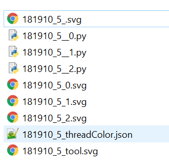

# ThreadPlotter 
Thread plotter package is a toolkit that can
1. store and process trajectories (paths), which are list of points that are connected in certain order. 
    2. ThreadPlotter only accept points and connect them with straight lines. If you have a curve (e.g., cubic bezier), you will need to approximate them with straight lines. 
2. write svg and axidraw-controlling python scripts.
    1. We utilize [the axidraw api](https://axidraw.com/doc/py_api/#functions-interactive) to get access to fundamental controls such as pen_up and pen_down.  (Don't forget to [install pyaxidraw on the computer that you are using to run the script](https://axidraw.com/doc/py_api/#installation).)
    
    2. If you use a different plotter, the python scripts would not work on your plotter. However, you can use the same strategy we took and modify the library to author in your own syntax.   

##Install 
We would recommend that you clone this repository so you have access to all of the sample projects. It also makes it easier for you to modify the threadPlotter, especially if you want to use it on plotters other than Axidraw. 

Here's a list of dependencies that you might need to install. 
```angular2html
   'Pillow >=7.1.2',
   'pyclipper>=1.1.0.post3',
   'svgpathtools>=1.3.3',
   'bs4 >=0.0.1'
```

Alternatively, you can install using pip. 
```angular2html
pip install threadPlotter
```

## Minimal Example 
To make a pattern, you need to initiate a ThreadPlotter instance and input pattern content. 

To customize a threadPlotter, you need a dictionary to store the settings.
 
For example, 
```python
settings={
    "name":"tp00_boundaryTester",#name of the project,required
    "baseSaveLoc":"C:/licia/art/generative/", #specify where to save the generated files,required
    "basic":{...},#stores settings related to the canvas. Will be stored as self.basicSettings.
    "spec":{...},#stores any user-defined specs. Will be stored as self.currentSpec
    }
``` 

The "basic" key stores canvas-related specs, such as width, height, and the margins of the canvas. The content of this key will be linked in a variable called "basicSettings". 
```python
   "basic":{
        #stores settings related to the canvas
        "width":10,#inches
        "height":10,#inches
        "toolsCt": 3,#how many colors
        "margins":{"l":2,"r":2,"t":2,"b":2},#in inches
        "unit": "inch",  # support px, inch and mm. 
        "displayInnerRect": False, #adding a boundary rectangle to the svg file (will not append to the python files)
        "displayOuterRect": False,
        "plotterDefaultSetting":{
            "model":2 #according to https://axidraw.com/doc/py_api/#model
        }
    },
```

The "spec" key stores everything that user want to define. The content of this key will be linked in a variable called "currentSpec". Users can add additional settings for their project but the following settings are required. 
```python
    "spec":{
        #stores any user-defined specs
        "segmentLength":0.04,#inches
        "trailStitchLength":0.15,
        "trailLoopDepthPerc":35,
        "plotterSettingRange":{
            "speedPercRange":[20,80],
            "depthPercRange":[35,100],#The range(%) that the z axis can move. 100% corresponds to the longest stitch whereas 55% corresponds to the shortest stitch
            "distanceRange":[0.03,0.15] #inches
        }
    }
```

When you are making your first embroidery, you might want to play with these settings to get an optimal spec for your plotter and fabrication goal. 

With the basic settings done, you can write your patterns. The most basic example is to build a boundary test -- a "boring" rectangle that goes around the edge of your frame. 
To do that, you need four steps:

1. Initiate a threadPlotter instance with the settings object. It will generate a "virtual" canvas for you with x randomly selected thread colors (x is controlled by "toolsCt" in your settings). It will also perform the canvas size calculations for you and store the converted dimensions (in px) into a variable called "wh_m" (short for width_height_within_margin). 

2. Generate a path list: a list of points. e.g.[[0,0],[100,100]] is a line. The helper script shapeEditing.py contains several functions for generating basic shapes such as polygons and rectangles. 

3. Store the path list into the ThreadPlotter instance using the "initPunchGroup" function. It requires a thread number (if you have 3 thread, your index can be 0, 1, or 2), and a path list. 

4. When you finish appending all the path lists, us ".saveFiles()" to export the result. 

Here's the script. You can also check the [full script here](../projects/tp00_boundaryTester/tp00_boundaryTester.py).

```python
from threadPlotter.Utils import shapeEditing as SHAPE

from threadPlotter.ThreadPlotter import ThreadPlotter as TP

settings={...}

testPlotter=TP(settings) #create an instance
boundaryRect = SHAPE.makeRectPoints(
    0, 
    0, 
    testPlotter.wh_m[0],
    testPlotter.wh_m[1],
    closed=True
) #making points for a rectangle. 
# wh_m is a list that stores the width and height within 
#   the plotable area (exclude margin).
# wh_m[0] is the width, and wh_m[1] is the height. 
# The value stored is in pixels. 
# If you use inch or mm, threadPlotter will convert your settings into px.

testPlotter.initPunchGroup(0, boundaryRect) 
#pattern information are going to be stored as 
#  PunchGroup instances. The initPunchGroup function takes
#  an id of the thread, and a list of (unprocessed) points


testPlotter.saveFiles()
#ThreadPlotter will process the path you provided 
#  by segmenting it and connecting multiple punch groups. 
#  Then, it will export svg and python to your selected directory.

```
In the folder you selected, you should see something like this:



 


